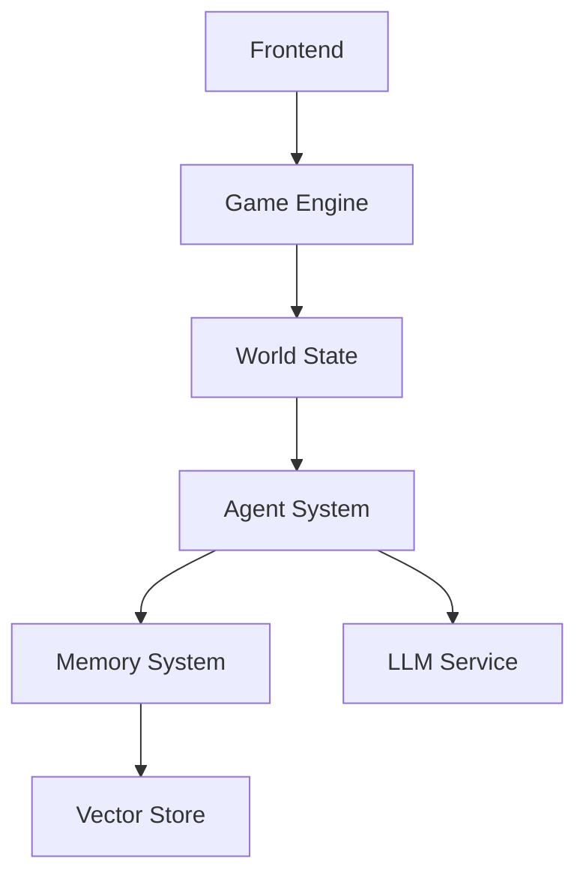

# AI Town Repository Map

## Core Types & Interfaces

### Game Engine Types
```typescript
// convex/engine/abstractGame.ts
export abstract class AbstractGame {
  abstract tickDuration: number;
  abstract stepDuration: number;
  abstract handleInput<Name extends InputNames>(now: number, name: Name, args: InputArgs<Name>);
  abstract tick(now: number): void;
  abstract saveStep(ctx: ActionCtx, engineUpdate: EngineUpdate): Promise<void>;
}

// convex/aiTown/game.ts
export class Game extends AbstractGame {
  world: World;
  historicalLocations: Map<GameId<'players'>, HistoricalObject<Location>>;
  descriptionsModified: boolean;
  worldMap: WorldMap;
  playerDescriptions: Map<GameId<'players'>, PlayerDescription>;
  agentDescriptions: Map<GameId<'agents'>, AgentDescription>;
}
```

### Memory System
```typescript
// convex/agent/schema.ts
export const memoryFields = {
  playerId: GameId<'players'>,
  description: string,
  embeddingId: Id<'memoryEmbeddings'>,
  importance: number,
  lastAccess: number,
  data: {
    type: 'relationship' | 'conversation' | 'reflection',
    // Type-specific fields...
  }
};

// convex/agent/memory.ts
export interface Memory extends Doc<'memories'> {
  playerId: GameId<'players'>;
  description: string;
  importance: number;
  data: RelationshipMemory | ConversationMemory | ReflectionMemory;
}
```

### World State
```typescript
// convex/aiTown/world.ts
export class World {
  nextId: number;
  conversations: Map<GameId<'conversations'>, Conversation>;
  players: Map<GameId<'players'>, Player>;
  agents: Map<GameId<'agents'>, Agent>;
  historicalLocations?: Map<GameId<'players'>, ArrayBuffer>;
}

// convex/aiTown/schema.ts
export const schema = defineSchema({
  worlds: defineTable({...}),
  engines: defineTable({...}),
  inputs: defineTable({...}),
  maps: defineTable({...}),
  messages: defineTable({...}),
  memories: defineTable({...}).vectorIndex('embedding')
});
```

## Critical Functions

### Agent System
```typescript
// convex/agent/conversation.ts
export async function startConversationMessage(
  ctx: ActionCtx,
  worldId: Id<'worlds'>,
  conversationId: GameId<'conversations'>,
  playerId: GameId<'players'>,
  otherPlayerId: GameId<'players'>,
): Promise<string>;

// convex/aiTown/agent.ts
export class Agent {
  tick(game: Game, now: number): void;
  startOperation<Name extends keyof AgentOperations>(
    game: Game,
    now: number,
    name: Name,
    args: AgentOperationArgs<Name>
  ): void;
}
```

### Memory Operations
```typescript
// convex/agent/memory.ts
export async function searchMemories(
  ctx: ActionCtx,
  playerId: GameId<'players'>,
  searchEmbedding: number[],
  n: number = 3,
): Promise<Memory[]>;

export async function rememberConversation(
  ctx: ActionCtx,
  worldId: Id<'worlds'>,
  agentId: GameId<'agents'>,
  playerId: GameId<'players'>,
  conversationId: GameId<'conversations'>,
): Promise<string>;
```

### Game Loop
```typescript
// convex/aiTown/main.ts
export const runStep = internalAction({
  args: {
    worldId: v.id('worlds'),
    generationNumber: v.number(),
    maxDuration: v.number(),
  },
  handler: async (ctx, args) => {
    const game = new Game(engine, args.worldId, gameState);
    while (now < deadline) {
      await game.runStep(ctx, now);
      // ... step logic
    }
  },
});
```

## Key Dependencies

### Data Flow


### State Management
```typescript
// src/hooks/useServerGame.ts
export function useServerGame(worldId: Id<'worlds'>): ServerGame {
  return useMemo(() => ({
    world: new World(worldState.world),
    agentDescriptions,
    playerDescriptions,
    worldMap
  }), [worldState, descriptions]);
}
```

### LLM Integration
```typescript
// convex/util/llm.ts
export const LLM_CONFIG = {
  embeddingDimension: 1536,
  chatModel: string,
  embeddingModel: string,
};

export async function chatCompletion(args: {
  messages: LLMMessage[];
  temperature?: number;
  max_tokens?: number;
  stop?: string[];
}): Promise<LLMResponse>;
```

## Core Systems

### Game Engine
- Manages game state and simulation
- Processes inputs and updates
- Handles time-based events
- Coordinates agent actions

### Agent System
- Controls AI behavior
- Manages memory and learning
- Handles conversations
- Makes decisions

### Memory System
- Stores and retrieves memories
- Manages embeddings
- Ranks importance
- Handles reflections

### Graphics System
- Renders game world
- Manages animations
- Handles viewport
- Controls sprites

## Development Patterns

### Adding Features
```typescript
// 1. Define new input type
export const newInput = inputHandler({
  args: { /* ... */ },
  handler: (game, now, args) => { /* ... */ }
});

// 2. Add state management
export class NewFeature {
  serialize(): SerializedNewFeature;
  tick(game: Game, now: number): void;
}

// 3. Update game logic
export class Game {
  newFeature: NewFeature;
  tick(now: number) {
    this.newFeature.tick(this, now);
  }
}
```

### Extending Agents
```typescript
// 1. Add new memory type
export const newMemoryType = v.object({
  type: v.literal('newType'),
  // ... fields
});

// 2. Add behavior
export async function handleNewBehavior(
  ctx: ActionCtx,
  agent: Agent,
  // ... args
): Promise<void>;

// 3. Integrate with agent loop
if (shouldDoNewBehavior) {
  this.startOperation(game, now, 'newBehavior', {...});
}
```